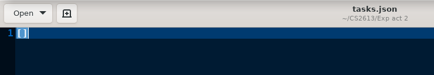
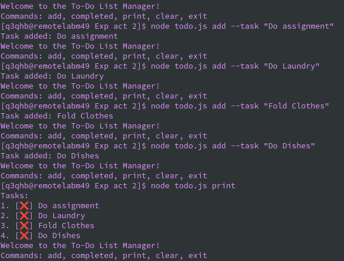
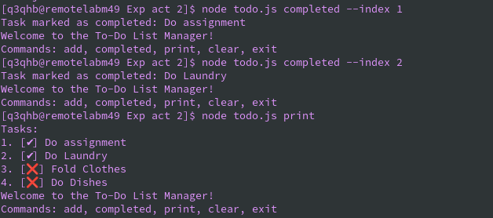
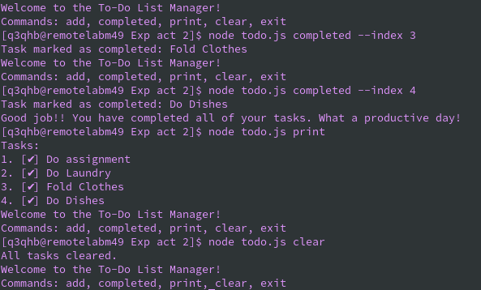
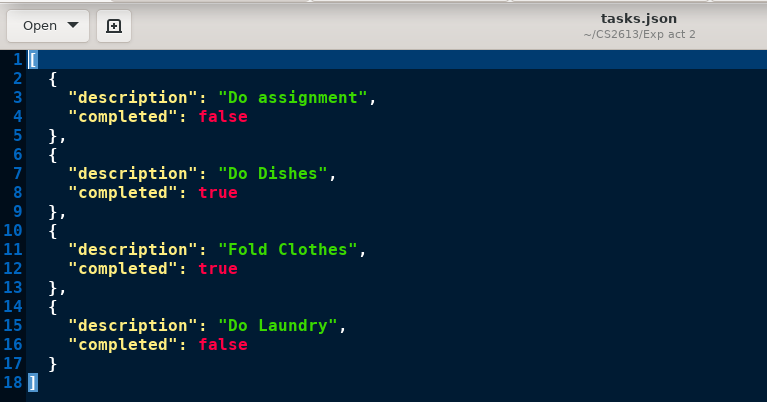

# ExplorationActivity2
## 1. Which package/library does the sample program demonstrate?
The sample program showcases the usage of the Yargs [^1^] library in Node.js. Yargs is a powerful library for building interactive command-line interfaces, providing a convenient way to parse command-line arguments and options. In the context of the sample program, Yargs is employed to handle user input and execute various commands, allowing users to interact with their to-do list from the command line.

[^1^]: Yargs Website, http://yargs.js.org/

## 2. How to Run
1. Make sure you have Node.js installed on your machine
2. Clone or download this repository to your local machine.
3. Navigate to the repository folder using the command line or terminal.
4. Run the following command to install the library:
    ```bash
    npm install yargs

5. Run the program by executing the following command:
    ```bash
    node todo.js

6.Follow the on-screen instructions to interact with the to-do list manager. For Example: 
    ```bash
    node todo.js add --task "Do PQ for CS2613"

or:
    ```bash
    node todo.js completed --index 1

to print out all tasks:
    ```bash
    node todo.js print


## 3. Program Purpose
The To-Do List Manager serves as a simple command-line tool to help users manage their to-do lists. It provides basic functionalities such as adding tasks, marking tasks as completed, printing the current tasks, clearing all tasks, and exiting the program.

## 4. Sample Input/Output
## Sample Input:
The primary input for the to-do list manager is through interactions in the CLI. The following are all of the examples of the commands that the to-do list manager accepts:
-Adding tasks: node todo.js add --task "task description here".
-Mark task as complete: node todo.js completed --index n, where n is a number. Index starts from 1 to improve user-friendliness
-Print all tasks: node todo.js print
-Clear all tasks: node todo.js clear
-Exit (without completing all tasks): node todo.js exit

The program uses JSON to store the tasks in a separate file and adds tasks or clears the file. This is done so that the program saves the tasks and doesn't lose the information every time the program is run again.
### Sample Output:
Here is a sample run of the program where the user inputs all their tasks, marks some as complete, prints out the tasks, then finishes all tasks. Once all tasks are marked as complete, the program will print out an encouraging message. 

1. **Initial JSON file, with no tasks.**: It will first be loaded with an empty array. 

2. **Adding Tasks & printing them out**: Here the user adds 4 tasks, then prints them out. 

3. **Marking complete**: The user finished 2 of his tasks, marked them as complete, then printed out all of his tasks again. 

4. **Finish all tasks**: Once the user marks the last remaining task as complete, the program prints out an encouraging message. The user then decides to print out all of his tasks 

5. **JSON File Update**: The JSON file gets updated every time the user interacts with the program using the arguments. 

